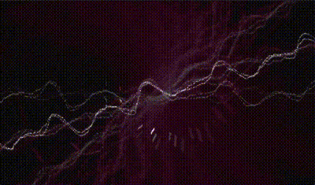

    

      
    

  # Milky.js

  ### Music Visualizer inspired by Ryan Geiss' work on "Geiss"

  
  
  #### &ndash; IN DEVELOPMENT | PRE-ALPHA &ndash;

  

> 🛠️ Milky.js makes use of the Web Audio API to capture Microphone or System audio output streams (using 3rd party software). Milky.js will render the waveform artistically and anachronistically - inspired by the wonderful work of <a href="https://www.geisswerks.com/geiss/" target="_blank">Ryan Geiss' screensaver/Winamp plugin "Geiss"</a>.

## 🌟 Preview

  

_Milky.js currently renders a 720p resolution at 30 FPS+ on a modern CPU (single core). SIMD (vector intrinsics optimization) and multi-core processing is in development and *should* allow for 60 FPS+ at 4k._

### 🔬 How does Milky.js work?

- ✅ **Milky.js runs on the CPU**: You'll find that the rendering code is written in C (standard C99), uses no graphics libraries whatsover and simply calculates each pixel value of a framebuffer on it's on.
-  ✅ **Waveform rendering**: First a waveform is rendered, that uses the captures the audio stream as a seed for the curve.
-  ✅ **Blending, Rotation, Transformation**: For every next frame, the previous framebuffer is slightly rotated and transformed (zoomed in). Also, the color intensity is blended out by a factor. This makes "older" waveform renderings diminish over time and allows for smooths transitions between frames.
-  ✅ **Colorization**: Pre-calculated (generated) color sets are used to colorize each frame.
-  ✅ **FFT analysis and spectral flux detection**: For every frame, the waveform is transformed into a frequency/volume spectrogram. This allows the program to measure, how loud each frequency is playing at each time. To detect energy spikes in lows and highs, the spectrum is averaged and diffed over time, and a spectral flux is calculated. Whenever the energy drastically differs from previous frames, `SIG_ENERGY` is detected.
- ✅ **Color and movement change automation**: Currently, all 30 secs, color changes may occur, when `SIG_ENEGRY` is detected. Also, rotation targets are randomly assigned so that the "flight" into the center of your monitor, feels artificially controlled.
- ✅ **Effects**: Currently, two "chasers" are rendered with each frame. Their movement vectors are pre-calculated and because they move fast and frames diminish over time, they come with a comets' trail effect. Also, a compelx interplay of trigonometric functions make sure that the movement isn't predictable, which adds to a feeling of artificiality.
- ✅ **Boring tech details, stunning for nerds**: In order to receive audio from the browser, Web Audio API's are used to attach to audio streams. Buffers are converted into `Uint8Array` buffers. A pointer to the base memory address of such buffers is handed into the WebAssembly module for analyzation. Likewise, the final framebuffer is also represented as a `Uint8Array` and it's pointer to the memory base address is references in JS runtime space. This allows for zero-copy, lock-free realtim processing. The framebuffer pixed values (RGBA, each 8 bit) are rendered onto a `Canvas2DContext` initialized `<canvas>` element. Oversampling allows for rendering at a higher resolution and helps with de-pixelization.

## 📚 Developer API

You can use Milky.js as a library, but this codebase is currently in alpha state. If you'd still like to use it, you'd need to dig into the codebase yourself and contribute its source in order to help fix bugs and issues. The `src/index.ts` file uses vanilla DOM API code to integrate the library. That's at the moment the best place to learn how to use Milky.js for your own projects.

## ❤️ Acknowledgements

<a href="https://www.geisswerks.com/geiss/" target="_blank">Ryan Geiss</a> inspired this project with his outstanding work on his program "Geiss". He also wrote a <a href="https://www.geisswerks.com/geiss/secrets.html" target="_blank">fantastic article</a>  on the architecture of his graphics rendering engine and the tricks he used. This allowed me to learn and adapt.